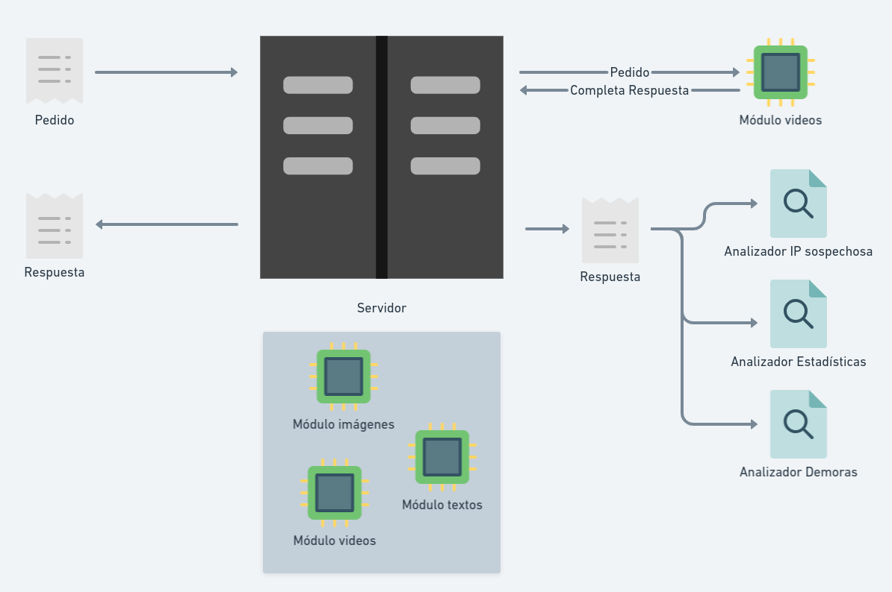

# Simulador de servidor web

## Antes de empezar: algunos consejos

El enunciado tiene **mucha** información, van a necesitar leerlo varias veces. La sugerencia es que lo lean entero una vez (para tener una idea general) y luego vuelvan a consultarlo las veces que hagan falta.

Concentrensé en los requerimientos y, excepto que se traben mucho, respeten el orden sugerido. No es necesario que hagan TDD, pero sí sería interesante que vayan creando las distintas clases y métodos a medida que resuelven cada requerimiento y no antes.

En otras palabras: trabajen completando cada requerimiento antes de pasar al siguiente, con los tests que aseguran que funciona incluidos. Si al avanzar en los requerimientos les parece necesario refactorizar, adelante, van a tener los tests que garantizan que no rompieron nada. :smirk:

## Descripción del dominio

Se nos pide modelar la estructura de un servidor web que atiende **pedidos**. De cada pedido nos interesa saber:
* la **dirección IP** de quien hace el pedido. Para este ejercicio se puede manejar como un `String`, por ejemplo: `"207.46.13.5"`;
* la **fecha y hora**. Se recomienda usar para esto la clase `LocalDateTime`;
* la **URL** que se está requiriendo, por ejemplo `http://pepito.com.ar/documentos/doc1.html`. 

A una **URL** posteriormente va a interesar descomponerla en estos datos, que se describen tomando `"http://pepito.com.ar/documentos/doc1.html"` como ejemplo:
* el **protocolo**, en este caso `"http"`;
* la **ruta**, en este caso `"/documentos/doc1.html"`;
* la **extensión**, en este caso `"html"`.

La respuesta a un pedido consiste de: 
* **tiempo** que tardó en responder (en milisegundos); 
* un [**código de respuesta**](https://es.wikipedia.org/wiki/Anexo:C%C3%B3digos_de_estado_HTTP);
* un _body_ o **contenido** que será un `String`;
* una referencia al **pedido** que la generó.

Los servidores que modelemos van a aceptar solamente el protocolo HTTP. Si el protocolo de la URL es distinto a "http" hay que devolver código de respuesta 501 (servicio no implementado). :eyes: **Ojo acá**: no se debe arrojar un error, sino que se debe devolver una respuesta con el código especificado

Para este y los errores que se definen más adelante vamos a devolver body vacío y tiempo de respuesta 10 milisegundos.

### Módulos

Un servidor web deriva todos los pedidos que acepta a un módulo. Los módulos que tiene el servidor son dinámicos y pueden quitarse o agregarse en cualquier momento. 

Para esta simulación vamos a soportar módulos que trabajan según la extensión del recurso que se está solicitando: por ejemplo, podríamos tener un módulo de imágenes que trabaja con `jpg`, `png` y `gif`, otro de texto que trabaja con `docx`, `odt`, etcétera.

De cada módulo se debe configurar:
* con qué **extensiones** puede trabajar (una colección),
* qué devuelve (un texto fijo),
* cuánto tarda (un número, también fijo).

Cuando se recibe un pedido, ocurre lo siguiente: 
1. Se busca, entre los módulos, alguno que pueda responder al pedido (no importa cuál). 
1. Si hay alguno, se genera una respuesta con el body y el tiempo de respuesta definido por el módulo, el código de respuesta 200 (OK) y el pedido que la generó.
1. Si no hay ningún módulo que pueda atender el pedido, se genera una respuesta con código 404 (Not found) y lo explicado más arriba sobre los errores.

### Analizadores

A un servidor también se le tienen que poder agregar analizadores, que se encargan de registrar y/o analizan distintos aspectos del tráfico. Puede no haber ningún analizador, uno o muchos. Se tienen que poder agregar y quitar dinámicamente.

Ante cada pedido que atiende, el servidor le envía _a todos_ los analizadores que tenga asignados en ese momento la respuesta y el módulo que la generó (si hubo uno). **Pista 🧐:** en el caso de que ningún modulo haya llegado a responder al pedido, se puede registrar un módulo nulo en su lugar (o bien `null`, o bien un objeto que represente al "no-modulo").

A partir del análisis de esas respuestas, a cada analizador se le pueden hacer ciertas consultas. El trabajo del servidor es simplemente reenviarle las respuestas, luego cada analizado decidirá qué hacer con ella.

#### Detección de demora en respuesta

Se le configura una **demora mínima** en milisegundos. Una respuesta cuyo tiempo de respuesta supere la demora mínima se considera demorada. 

Se le tiene que poder preguntar, para un módulo, la cantidad de respuestas demoradas.

#### IPs sospechosas

Se configura una colección de IPs sospechosas, y debe ir registrando todos los pedidos que estas IPs realizaron. A partir de eso, se debe poder consultar:

* cuántos pedidos realizó una cierta IP sospechosa,
* cuál fue el módulo más consultado por todas las IPs sospechosas,
* el conjunto de IPs sospechosas que requirieron una cierta ruta.

#### Estadísticas

Considerando todas las respuestas que hubo, se le tiene que poder preguntar:

* tiempo de respuesta promedio, 
* cantidad de pedidos entre dos momentos (fecha/hora) que fueron atendidos, 
* cantidad de respuestas cuyo body incluye un determinado `String` (p.ej. cuántas respuestas dicen "hola", lo que incluye "hola amigos" y "ayer me dijeron hola 4 veces"), 
* porcentaje de pedidos con respuesta exitosa.

## Requerimientos

Se pide implementar la solución a este problema en Kotlin, junto con los tests que prueben cada uno de los requerimientos.

1. Implementar el servidor _sin módulos_, haciendo que devuelva 200 si el protocolo es el correcto, y 501 si no lo es.
1. Incorporar los módulos.
1. Incorporar los analizadores. Ayuda: las consultas que se piden tienen que ser métodos del analizador correspondiente, no del servidor. 

## Licencia
  
Esta obra fue elaborada por [Federico Aloi](https://github.com/faloi) y publicada bajo una [Licencia Creative Commons Atribución-CompartirIgual 4.0 Internacional][cc-by-sa].

[![CC BY-SA 4.0][cc-by-sa-image]][cc-by-sa]

[cc-by-sa]: https://creativecommons.org/licenses/by-sa/4.0/deed.es
[cc-by-sa-image]: https://licensebuttons.net/l/by-sa/4.0/88x31.png

### Créditos

:memo: [Enunciado original](https://web-ciu-programacion.github.io/site/material/documentos/ejercicios/webserver.pdf) creado por [Carlos Lombardi](https://github.com/clombardi).

:camera_flash: Imagen de portada por <a href="https://unsplash.com/@wocintechchat?utm_source=unsplash&utm_medium=referral&utm_content=creditCopyText">Christina @ wocintechchat.com</a> en <a href="https://unsplash.com/s/photos/web-server?utm_source=unsplash&utm_medium=referral&utm_content=creditCopyText">Unsplash</a>.
